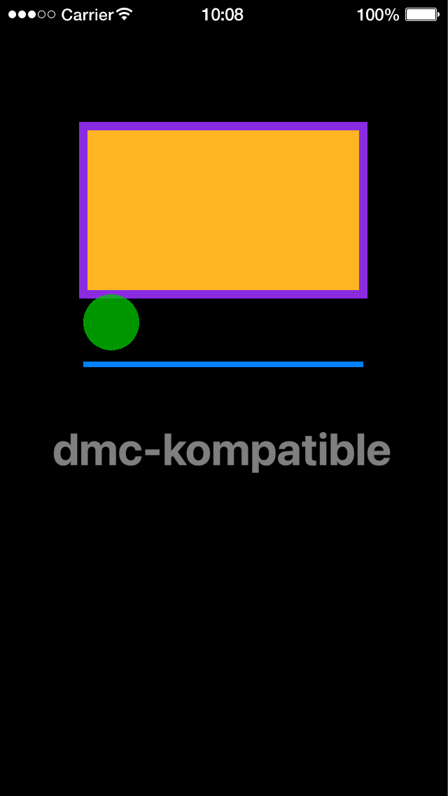

# dmc-kompatible

Graphics 1.0 compatibility for Solar2D (formerly Corona SDK): run code written for Corona's Graphics 1.0 with fewer changes, with colors in 0-255 (alpha too) and objects placed by reference points.

dmc-kompatible gives you its own `display` and `native` tables. Objects made with them take 0-255 colors and Graphics 1.0's reference points and methods; everything else is Solar2D's own:

```lua
local display, native = require( 'dmc_corona.dmc_kompatible' )()

local rect = display.newRect( 160, 100, 200, 100 )
rect:setFillColor( 255, 180, 34, 128 )
rect:setReferencePoint( display.TopLeftReferencePoint )
```

## Features

- `setFillColor()` and `setStrokeColor()` take 0-255 values, alpha included, as Graphics 1.0 did; also hex strings (`'#FFB422'`) and gradients with 0-255 colors
- Graphics 1.0's `text:setTextColor()` and `line:setColor()`, and a 0-255 `setTextColor()` on native text fields and boxes
- `setReferencePoint()` with the nine Graphics 1.0 reference points (`display.TopLeftReferencePoint`, ...), and each new object starts with one
- Local by default: only the files that require dmc-kompatible see the change, so other libraries keep Solar2D's `display` and `native`
- Each change can be turned off in `dmc_corona.cfg`
- Pure Lua, no plugins needed; MIT licensed

dmc-kompatible is for an existing Graphics 1.0 app. For new code, [dmc-kozy](https://github.com/dmccuskey/dmc-kozy) has some of the same conveniences, with Solar2D's 0-1 alpha. If you only need the colors, [dmc-kolor](https://github.com/dmccuskey/dmc-kolor) translates them without changing any Solar2D method.

## Quick Start

The following code will get you up and running in about 10 minutes in the Solar2D Simulator on macOS or Windows. It draws shapes and text with Graphics 1.0 colors and reference points.

Prerequisites: the [Solar2D](https://solar2d.com/) Simulator and a copy of this repository (`git clone https://github.com/dmccuskey/dmc-kompatible.git`, or download the ZIP from GitHub).

### 1. Copy the Library into Your Project

Copy these from this repository into the root of your project folder:

```text
dmc_corona_boot.lua     loader for the DMC libraries
dmc_corona.cfg          configuration
dmc_corona/             dmc-kompatible
```

**Going further:** keep the libraries in a subfolder, or combine several DMC libraries ([dmc-corona-boot Configuration](https://github.com/dmccuskey/dmc-corona-boot/blob/master/docs/configuration.md)).

### 2. Draw the Graphics 1.0 Way

Create `main.lua` in the project folder:

```lua
local display, native = require( 'dmc_corona.dmc_kompatible' )()

local W = display.contentWidth

-- Graphics 1.0 code: 0-255 colors, alpha too, and reference points

-- an orange box with a purple border
local box = display.newRect( W/2, 300, 400, 240 )
box:setFillColor( 255, 180, 34 )
box.strokeWidth = 12
box:setStrokeColor( 138, 43, 226 )

-- a see-through green dot, placed by its top-left corner
local dot = display.newCircle( 0, 0, 40 )
dot:setReferencePoint( display.TopLeftReferencePoint )
dot.x, dot.y = box.x - 200, box.y + 120
dot:setFillColor( 0, 200, 0, 192 )

-- a blue line under the box
local line = display.newLine( 120, 520, W-120, 520 )
line.strokeWidth = 8
line:setColor( 0, 128, 255 )

-- half-transparent white text
local label = display.newText( 'dmc-kompatible', W/2, 640, native.systemFontBold, 64 )
label:setTextColor( 255, 255, 255, 128 )

print( dot.anchorX, dot.anchorY, label.fill.a, line.stroke.g )
```

Open the project in the Simulator. It shows an orange box with a purple border, a green dot under its bottom-left corner, a blue line, and grey text (white at half alpha). The console shows the warning dmc-kompatible prints at the first line (see Configuration), then the dot's anchor, the text's alpha and the line's green in Solar2D's 0-1 values:

```text
WARNING dmc_kompatible: change newLine property 'width' to 'strokeWidth'
0	0	0.50196081399918	0.50196081399918
```



If the console shows `module 'dmc_corona.dmc_kompatible' not found` instead, `dmc_corona/` is missing from the root of the project folder. Require it by that full name: `require( 'dmc_kompatible' )` fails, because the loader that finds the DMC libraries runs only once dmc-kompatible is loading.

**Going further:** which objects get which methods, the settings and the known issues are below.

To update, copy `dmc_corona_boot.lua` and `dmc_corona/` again from the newer version. Keep your own `dmc_corona.cfg` if you have changed it.

## Converting an App

Two ways to bring a whole Graphics 1.0 app across:

1. **Quickest: `MAKE_GLOBAL`.** Set it in `dmc_corona.cfg` (see [Configuration](#configuration)) and require dmc-kompatible once, at the top of `main.lua`. Every file then gets dmc-kompatible's `display` and `native`. Whether it works depends on the other libraries in the app: one that expects Solar2D's own 0-1 colors gets nearly black ones.
2. **File by file.** Put the `require` line at the top of each file that uses Graphics 1.0 code. To find them, run the app, add the line to the file named in the first error, and run it again, until the errors stop.

The second way leaves every other file and library on Solar2D's own `display` and `native`. To take only one of the two tables, leave the other out: `local display = require( 'dmc_corona.dmc_kompatible' )()`.

## API

```lua
local display, native = require( 'dmc_corona.dmc_kompatible' )()
```

Call the module to get the two tables. It also holds them as `.display` and `.native`, and its version as `.VERSION`. Anything dmc-kompatible doesn't change falls through to Solar2D's own `display` and `native`, so `display.contentWidth` and `native.systemFont` work as usual.

### Objects and Their Methods

These constructors return Solar2D's object with methods added, and its anchor set to a reference point:

| constructor | reference point | 0-255 color methods |
|---|---|---|
| `display.newCircle`, `newRect`, `newRoundedRect` | center | `setFillColor()`, `setStrokeColor()` |
| `display.newPolygon` | top left | `setFillColor()`, `setStrokeColor()` |
| `display.newImage`, `newImageRect` | top left | `setFillColor()` |
| `display.newText` | center | `setFillColor()`, `setTextColor()` |
| `display.newLine` | top left | `setStrokeColor()`, `setColor()` |
| `display.newGroup`, `newContainer`, `newSprite` | unchanged | none |
| `native.newTextField`, `newTextBox` | top left | `setTextColor()` |
| `native.newWebView` | top left | none |

Every one gets `setReferencePoint()`. Solar2D's own color method is kept on the object with an underscore: `object:_setFillColor( 1, 0, 0 )` takes 0-1 values. A constructor that returns `nil`, such as `display.newImage()` for a missing file, returns `nil` here too.

Objects made any other way, including with Solar2D's own `display` in a file that doesn't require dmc-kompatible, are unchanged.

### object:setFillColor( ... ), object:setStrokeColor( ... ), object:setTextColor( ... )

The color, in one of these forms:

| form | example | notes |
|---|---|---|
| gray | `( 128 )` | 0-255 |
| gray, alpha | `( 128, 192 )` | 0-255 |
| red, green, blue | `( 255, 180, 34 )` | 0-255 |
| red, green, blue, alpha | `( 0, 128, 255, 192 )` | 0-255 |
| hex string | `( '#FFB422' )` | `#RRGGBB`, no alpha |
| gradient | `{ type='gradient', color1={ 255, 180, 34 }, color2={ 138, 43, 226, 128 }, direction='down' }` | colors and alpha 0-255, alpha optional; your table is left as it is |
| other paint | `{ type='image', filename='wood.png' }` | passed to Solar2D unchanged |

Solar2D's own 0-1 values don't work on these objects: `( 1, 0, 0 )` is nearly black. Anything else raises an error, such as a color name (`'red'`: use [dmc-kolor](https://github.com/dmccuskey/dmc-kolor) for names), a short hex string (`'#F00'`) or a string among the numbers.

### object:setReferencePoint( point ), object:setReferencePoint( x [, y] )

Set `anchorX` and `anchorY`, from 0 to 1: from one of the reference points, or from two numbers; a number left out keeps its current value. Solar2D's own `display.CenterReferencePoint` (and the others) work too. Anything else raises an error, including `nil` from a misspelled name:

| `display.` | anchor | `display.` | anchor | `display.` | anchor |
|---|---|---|---|---|---|
| `TopLeftReferencePoint` | 0, 0 | `TopCenterReferencePoint` | 0.5, 0 | `TopRightReferencePoint` | 1, 0 |
| `CenterLeftReferencePoint` | 0, 0.5 | `CenterReferencePoint` | 0.5, 0.5 | `CenterRightReferencePoint` | 1, 0.5 |
| `BottomLeftReferencePoint` | 0, 1 | `BottomCenterReferencePoint` | 0.5, 1 | `BottomRightReferencePoint` | 1, 1 |

Unlike Graphics 1.0, the object keeps its `x` and `y`, so it moves on screen: set `x` and `y` after the reference point, as in the Quick Start. A group's anchor only has an effect with `group.anchorChildren = true` (Solar2D's rule).

## Configuration

The `[DMC_KOMPATIBLE]` section of `dmc_corona.cfg`; all settings are read once, when dmc-kompatible is first required. All are booleans: `MAKE_GLOBAL:BOOL = true`, or `MAKE_GLOBAL = true` without the type. For the file format, see [dmc-corona-boot Configuration](https://github.com/dmccuskey/dmc-corona-boot/blob/master/docs/configuration.md).

| setting | type | default | effect |
|---|---|---|---|
| `MAKE_GLOBAL` | bool | `false` | replace the global `display` and `native` with dmc-kompatible's, for every file and every other library in the app. Use with care: other code may expect Solar2D's own |
| `PRINT_WARNINGS` | bool | `true` | print a warning, once, at the first `display.newLine()`: a line's `width` is now `strokeWidth` |
| `ACTIVATE_REFERENCE` | bool | `true` | add `setReferencePoint()`, and set each new object's reference point |
| `ACTIVATE_FILLCOLOR` | bool | `true` | add the 0-255 `setFillColor()`, `setTextColor()` and `line:setColor()` |
| `ACTIVATE_STROKECOLOR` | bool | `true` | add the 0-255 `setStrokeColor()` |

## Known Issues

None known. The changes in each version are in the [CHANGELOG](CHANGELOG.md).

## Development

Only `dmc_corona/dmc_kompatible.lua` is written in this repository; it needs no other module. `dmc_corona_boot.lua` is a generated copy from [dmc-corona-boot](https://github.com/dmccuskey/dmc-corona-boot); fix it there, then rebuild. The copy is made by Snakemake from sibling checkouts (`../dmc-corona-boot`, `../DMC-Corona-Library` for the shared rules). From this repository's root folder:

```sh
snakemake --cores 1 build_all
```

The unit tests run in plain Lua 5.1, with stand-ins for Solar2D's `display` and `native`:

```sh
tests/run_unit.sh
```

They need Lua 5.1 and dkjson; `LUA=` names the interpreter. The Quick Start is the check that it works in Solar2D.

## License

dmc-kompatible is released under the [MIT License](LICENSE).
